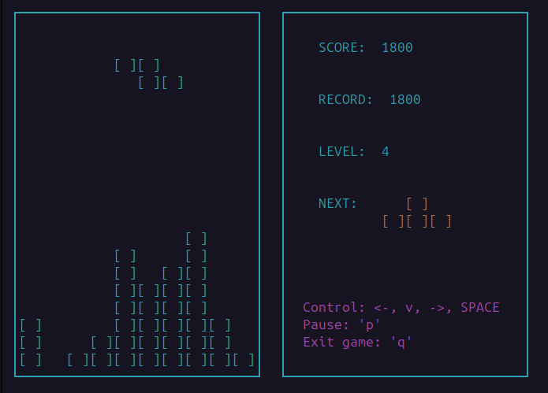

# BrickGame v1.0 aka Tetris

**BrickGame v1.0** is a classic Tetris game implemented in C using the `ncurses` library for the terminal interface. The project is divided into two parts: a library that implements the game logic and a terminal interface. The game logic is based on a finite state machine, and the project is built using a `Makefile`.

## Features

- Implementation in C (C11 standard) using the `gcc` compiler.
- Game logic implemented as a library.
- Terminal interface using the `ncurses` library.
- Support for all classic Tetris mechanics:
  - Figure rotation.
  - Horizontal figure movement.
  - Accelerated figure drop.
  - Display of the next figure.
  - Clearing filled lines.
  - Game over when the top of the field is reached.
- Support for all Tetris figures.
- Score calculation and high score storage.
- Level mechanics: game speed increases with each level.

## Requirements

- `gcc` compiler.
- `ncurses` library (for the terminal interface).
- `check` library (for unit tests).
- OS: Darwin (macOS) or Ubuntu.

## Project Structure

- **`src/brick_game/tetris`**: Code for the library implementing the game logic.
- **`src/gui/cli`**: Code for the terminal interface using `ncurses`.
- **`tests`**: Unit tests for the library.
- **`Makefile`**: File for building and managing the project.

## Additional Features

### Score Calculation and High Score
- Points are awarded for clearing lines:
  - 1 line: 100 points.
  - 2 lines: 300 points.
  - 3 lines: 700 points.
  - 4 lines: 1500 points.
- The high score is saved between game sessions.

### Level Mechanics
- Every 600 points increases the level by 1.
- Game speed increases with each level.
- Maximum level: 10.

## Installation And Running the Game
- Clone the repository on your computer.
- Navigate to the `src/` directory.
- Build the project: `make all` or `make install`.
- Play: `make run`

## Testing
- To run unit tests:`make test`
- To generate a test coverage report: `make gcov_report`
